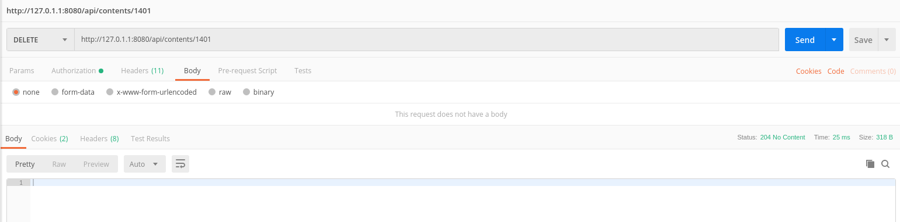

# microtest

This application was generated using JHipster 6.0.1, you can find documentation and help at [https://www.jhipster.tech/documentation-archive/v6.0.1](https://www.jhipster.tech/documentation-archive/v6.0.1).

## Endpoints
All the endpoints are documented in the [`swagger.yaml`](swagger.yaml) file. 
- Usual flow:
    - Register an user in `/api/register` or a service in `/api/register-service`. Example (with only the required parameters):
    
    
        
    - Authenticate your user/service in `/api/authenticate` to receive a JWT Token and use it as a Bearer token.
    
    - Use that token to create your own `Contents`, with a `POST` request to `/api/contents`:
    
    - Get all of your contents with a `GET` request to `/api/contents`
    
    - Or a single content with a `GET` request to `/api/contents/{id}`
    
    - Modify your content with a `PUT` request to `/api/contents/`
    
    - Delete a content with a `DELETE` request to `/api/contents/{id}`
    
## Building for production

### Packaging as war

To package your application as a war in order to deploy it to an application server, run:

    ./gradlew -Pprod clean bootWar

## Using Docker to simplify development (optional)

You can use Docker to improve your JHipster development experience. A number of docker-compose configuration are available in the [src/main/docker](src/main/docker) folder to launch required third party services.

For example, to start a postgresql database in a docker container, run:

    (sudo) docker-compose -f src/main/docker/postgresql.yml up -d

To stop it and remove the container, run:

    (sudo) docker-compose -f src/main/docker/postgresql.yml down

You can also fully dockerize your application and all the services that it depends on.
To achieve this, first build a docker image of your app by running:

     (sudo) ./gradlew bootJar -Pprod jibDockerBuild

Then run:

    (sudo) docker-compose -f src/main/docker/docker-compose.yml up -d

For more information refer to [Using Docker and Docker-Compose][], this page also contains information on the docker-compose sub-generator (`jhipster docker-compose`), which is able to generate docker configurations for one or several JHipster applications.
